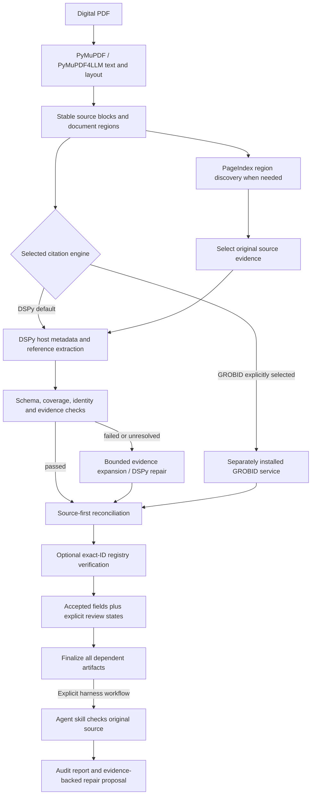

# CiteIndex citation accuracy: comparison and improvement plan

Date: 2026-09-14. Status: implementation in progress; human-reviewed benchmark gates remain pending.
Local baseline: branch `citeindex-2.0`, commit `6701111c28f4d88737fe547ca9f39b28368944a4`.

## Recommendation

**Make DSPy the default citation extraction engine for digital PDFs. Offer GROBID only as an explicitly selected alternative engine requiring a separately installed service; never switch engines automatically.** Build a benchmark first, then incorporate GROBID's layout-aware staged parsing, PaperQA2's evidence selection, and PageIndex's hierarchical region discovery into CiteIndex's native pipeline. Balance accuracy and cost with cheap core checks and optional agent-driven re-verification.

This revision follows the user's explicit direction. DSPy signatures define extraction contracts; the configured LLM performs extraction. Adopting GROBID's architecture does not import its trained models or establish equivalent accuracy. GROBID must not be required for installation or successful native ingestion.

Confirmed user decisions: extraction and evidence verification only; no document question answering; DSPy is the default engine; GROBID is a separately installed, explicitly chosen alternative, not a fallback; balanced accuracy/cost; deeper re-verification belongs in Codex/OpenCode/other harness skills. “Paperindex” refers to VectifyAI PageIndex. The academic skills reference is provisionally identified as `Imbad0202/academic-research-skills` because several repositories share that name.

CiteIndex already has the necessary foundation: multiple ingestion backends, GROBID, PageIndex, source locators, Crossref reconciliation, and verification before persistence. The immediate opportunity is preventing information loss and incorrect attribution across these stages. A larger model alone will not fix discarded authors, dropped references, or a DOI borrowed from the bibliography.

This plan covers three distinct meanings of citation accuracy:

1. **Source metadata:** correctly citing the document being ingested, including its particular edition/version.
2. **References:** detecting and parsing works cited inside that document.
3. **Attribution:** connecting a citation marker or footnote to the right reference and original source location.

Generated-answer correctness is a separate, deferred task. Merkle integrity proves artifact consistency, not bibliographic truth.

## GitHub comparison

These systems address different stages; their headline accuracy numbers are not interchangeable.

| Project | Actual role and useful capabilities | Fit for CiteIndex | Limitations and decision |
| --- | --- | --- | --- |
| [GROBID](https://github.com/grobidOrg/grobid) | Scholarly PDF metadata, bibliography parsing, document structure, and reference markers through trained sequence-labeling models. TEI output; standalone service. | Borrow layout-aware region segmentation, task-specific parsing, and synchronized source coordinates. Offer its service as an alternative engine. | Not an OCR replacement. Requires extra service installation and explicit engine selection; never called by the DSPy engine. |
| [Paper-QA](https://github.com/Future-House/paper-qa) | Finds papers, retrieves chunks, scores contextual evidence, and generates answers with citations. | Borrow the separation of document identity, evidence gathering, and answer generation. Potential future consumer of CiteIndex artifacts. | Its QA performance does not establish bibliography extraction accuracy. Adding the full agent/retrieval stack is unnecessary for the immediate problem. |
| [PageIndex](https://github.com/VectifyAI/PageIndex) | Hierarchical document indexing and tree-based retrieval. Current upstream offers SDK local mode and Flash indexing; CiteIndex has an existing bundled integration. | Useful for locating title pages, colophons, bibliography sections, and long-document context. | A section tree or summary is not evidence for an author or DOI. Do not assume the bundled integration has current SDK capabilities. Retain it; benchmark evidence-location benefits independently. |

GROBID documents CRF and deep-learning configurations, with some deep-learning models improving reference parsing. This warrants a controlled configuration experiment, not an assumption that the local server already uses those models. Its code is Apache-2.0. [GROBID repository](https://github.com/grobidOrg/grobid).

Paper-QA's manual `Docs.aadd()` path can generate a citation from the first text chunk, then infer structured metadata. That path is not an independent authority for CiteIndex's gold labels. Its metadata client separates providers and post-processing and supports staged lookup; use that idea only when additional providers are justified by measured failures. [Document ingestion code](https://github.com/Future-House/paper-qa/blob/main/src/paperqa/docs.py), [metadata client code](https://github.com/Future-House/paper-qa/blob/main/src/paperqa/clients/__init__.py). Paper-QA is [Apache-2.0](https://github.com/Future-House/paper-qa/blob/main/LICENSE); PageIndex is [MIT](https://github.com/VectifyAI/PageIndex/blob/main/LICENSE).

Paper-QA's LitQA evaluation measures scientific question answering. PageIndex's published QA results, including FinanceBench, measure retrieval/answering rather than CSL extraction. GROBID's end-to-end evaluation is closer to this task and distinguishes headers, references, and full text. None substitutes for CiteIndex's CJK/OCR/edition-specific evaluation. [Paper-QA reproduction instructions](https://github.com/Future-House/paper-qa#reproduction), [PageIndex benchmarks](https://github.com/VectifyAI/PageIndex#benchmarks), [GROBID evaluation](https://grobid.readthedocs.io/en/latest/End-to-end-evaluation/).

## What the current code shows

These are static observations from the current checkout, not measured error rates. Graph discovery was followed by current-file inspection because a separate review graph reported an older branch.

| Priority | Finding and evidence | Accuracy implication |
| --- | --- | --- |
| P0 | `validate_authors()` keeps only three authors when more than five survive validation: [common.py](../../citeindex/ingestion/pipelines/common.py), lines 480–553. Master applies it to pipeline authors: [master.py](../../citeindex/ingestion/master.py), lines 111–129. | Correct multi-author records lose names. Broad English-word filters also need adversarial name/organization fixtures. |
| P0 | Host DOI extraction searches the whole TEI tree: [grobid.py](../../citeindex/ingestion/pipelines/grobid.py), lines 264–311. Verification falls back to the first DOI found in document evidence: [citation_verification.py](../../citeindex/ingestion/citation_verification.py), line 252. | If the host has no DOI, a cited work's DOI can become a candidate for the host. This is an attribution risk, not just a normalization problem. |
| P0 | Verification skips registry fields that already agree; `verified` depends on registry success and absence of recorded conflicts: [citation_verification.py](../../citeindex/ingestion/citation_verification.py), lines 257–317. | Agreement is not a source check. Missing fields and fields outside the reconciliation set need explicit status; nested references are not individually verified. |
| P1 | Every parsed `biblStruct` starts as `article-journal`; the reference collector drops entries without a title and falls back to all `biblStruct` elements: [grobid.py](../../citeindex/ingestion/pipelines/grobid.py), lines 74–176. | Books can be mistyped, legitimate incomplete references disappear, and header structures can enter the reference list when back matter is absent. |
| P1 | `_text_or_none()` only joins descendant text when `.text` is absent; `_parse_author()` takes the first forename: [grobid.py](../../citeindex/ingestion/pipelines/grobid.py), lines 26–56. | Mixed-content titles and multiple given-name components can be lost during conversion. |
| P1 | Host TEI conversion extracts a narrow field set. Digital base CSL starts as `book`; a nonempty GROBID result suppresses LLM fallback: [digital_pdf.py](../../citeindex/ingestion/pipelines/digital_pdf.py), lines 584–604; [common.py](../../citeindex/ingestion/pipelines/common.py), lines 374–434. | Partial records remain incomplete, and a source type can remain wrong despite a successful extraction. |
| P1 | Digital processing obtains GROBID metadata and references, then the cascade calls metadata extraction again: [digital_pdf.py](../../citeindex/ingestion/pipelines/digital_pdf.py), lines 428–443, 568–594; [common.py](../../citeindex/ingestion/pipelines/common.py), lines 354–434. | Repeated full-text requests waste time and can produce inconsistent fallback outcomes. Reuse one response. |
| P1 | GROBID requests do not explicitly set consolidation or request raw citation/coordinate output; the adapter returns parsed CSL only: [grobid.py](../../citeindex/ingestion/pipelines/grobid.py), lines 183–216, 342–403. | Evidence and service behavior are insufficiently explicit for reliable comparison and replay. |
| P1 | Scanned common processing extracts host metadata with DSPy priority but has no explicit bibliography parsing stage: [scanned_common.py](../../citeindex/ingestion/pipelines/scanned_common.py), lines 149–252; [dspy_extract.py](../../citeindex/ingestion/pipelines/dspy_extract.py), lines 676–705. | Structured OCR text does not automatically become structured cited references. Model overwrites also need field-level source checks. |
| P2 | The digital classifier tolerates up to 10% image-only/sparse nonblank pages; README documents that image-only content on this route is not OCR'd: [pdf_classifier.py](../../citeindex/ingestion/pdf_classifier.py), line 98; [README](../../README.md#ingestion-pipelines). | A short image-only title page or bibliography can be omitted even when most document text is usable. Measure this explicitly. |

Existing tests cover reconciliation, registry failures, locators, and persistence ordering, including small JSON fixtures. They are valuable regression tests, but the inspected `tests/` and workflows do not provide a representative, scored source-document benchmark. See [verification tests](../../tests/test_citation_verification.py), [registry tests](../../tests/test_metadata_registry.py), and [integration test](../../tests/test_master_verification_integration.py).

## Target architecture: explicit engine choice, source evidence authoritative

The diagram is CiteIndex's proposed design, not an upstream implementation claim. Build extraction blocks before mutable headings and summaries. Region discovery uses PDF outline/layout first; PageIndex is an additional route, not a prerequisite for every short document. A broken tree cannot prevent scanning the source blocks. If PageIndex remains enabled for exported navigation, build/reuse that tree once and attach final CSL only after reconciliation.

### What to adopt from each project

| Source | Principle supported by upstream | Concrete CiteIndex adaptation | Validation |
| --- | --- | --- | --- |
| GROBID | Region segmentation precedes specialized header/reference parsing; layout coordinates accompany text. [Architecture](https://grobid.readthedocs.io/en/latest/Principles/) | Preserve lines, bounding boxes, font/style where available, reading order, and physical page indexes. Separate host metadata, reference segmentation, reference parsing, and marker linking. Use DSPy for semantic extraction. | Region coverage, reference-boundary F1, field accuracy, coordinate validity |
| PaperQA2 | Gather evidence, assess relevance, and refine selected context before producing an answer. [Algorithm](https://github.com/Future-House/paper-qa#paperqa2-algorithm) | Treat each unresolved field as an evidence request. Retrieve candidates by region/terms, optionally rerank with DSPy, then extract from the original blocks. Keep evidence across conflicting candidates and abstain when unsupported. | Evidence recall at the fixed context budget, accepted-field precision, calls per document |
| PaperQA2 | Metadata providers are separate from downstream processing. [Client code](https://github.com/Future-House/paper-qa/blob/main/src/paperqa/clients/__init__.py) | Reuse the existing Crossref client and provenance report; keep registry agreement separate from source support. Reuse document extraction by source/config digest. | No duplicate extraction, correct invalidation, reproducible registry replay |
| PageIndex | A hierarchical index supports navigating long documents. [Repository](https://github.com/VectifyAI/PageIndex) | Use section ranges to seek title/copyright pages, colophons, bibliography, and note context; expand neighboring blocks when an entry crosses a boundary. | Evidence-location recall and latency versus layout-only lookup |
| DSPy | Signatures specify named, typed inputs/outputs; optimization uses evaluated programs. [Signatures](https://dspy.ai/getting-started/expanding-signatures/), [optimization](https://dspy.ai/getting-started/gepa-optimization/) | Use explicit extraction contracts and evaluate examples/prompts against the benchmark. Check installed-version support before choosing an optimizer; no automatic package upgrade is assumed. | Schema compliance, held-out extraction accuracy, fixed optimizer budget |

Implement these patterns with existing dependencies. A PaperQA2 package dependency, vector database, new OCR engine, and PageIndex SDK migration are not required to adopt these ideas. Model relevance scores are routing signals, not calibrated correctness probabilities. Summaries may guide retrieval but never count as source quotations.

### DSPy task contracts

Extend [dspy_extract.py](../../citeindex/ingestion/pipelines/dspy_extract.py) and reuse the model factory and shared CSL conversion; inspect callers of [model.py](../../citeindex/model.py) before replacing the existing `CitationLLM` path. Avoid a separate digital-only extraction stack with competing precedence rules.

| Task | Inputs | Required outputs |
| --- | --- | --- |
| Classify ambiguous regions, only when rules are insufficient | Source block IDs, text, layout cues, neighboring blocks | Region roles tied to existing block IDs; explicit unknowns |
| Extract host metadata | Candidate front matter/colophon blocks, document-type hypothesis | Structured CSL candidates, author/editor/translator roles, field evidence IDs, absent/uncertain states |
| Segment and parse references | Bibliography/footnote blocks with boundary overlap | Ordered entries, original spans, structured CSL candidates, unparsed residue and ambiguity states |
| Resolve remaining fields or links | Competing values/targets and selected original evidence | Supported selection or abstention, evidence IDs, concise reason |

These are bounded tasks, not autonomous agents. Preserve raw entries before normalization; software computes and validates character offsets from returned block IDs and exact quotes. Do not trust LLM-generated offsets, IDs, or schema compliance without checking them. Use structured author arrays rather than lossy semicolon splitting in the shared output contract. Track no-bibliography separately from bibliography-not-found and partial extraction.

### Improve signatures and evaluate a shared DeepSeek default

Recommendation: use `deepseek-v4.1-flash:cloud` as the proposed common text-model default, subject to adapter checks and the pilot benchmark. Its exact tag is listed by [Ollama](https://ollama.com/library/deepseek-v4.1-flash). In CiteIndex's existing provider-qualified convention, the planned value is `ollama/deepseek-v4.1-flash:cloud`. Catalog availability does not prove that the installed DSPy/LiteLLM/Ollama combination supports every requested output option; verify an actual structured response before promoting it. No model calls or configuration changes were performed during planning.

The current defaults are `ollama/glm-5.3-flash:cloud` in [models.py](../../citeindex/ingestion/models.py), lines 33 and 49, and [pageindex_tree.py](../../citeindex/ingestion/pipelines/pageindex_tree.py), line 32. Update defaults consistently at implementation time after finding all CLI/model/config callers; preserve explicit user overrides.

| Use | Planned model policy |
| --- | --- |
| DSPy host metadata and reference extraction | Shared DeepSeek default for digital and scanned text, and other existing general text-extraction calls |
| PageIndex tree summaries/region selection | Inherit the shared default unless `pageindex_model` is explicitly overridden |
| Optional evidence reranking or bounded repair | Same model, used selectively; no default multi-model ensemble |
| Optional API-based citation verifier | Remains disabled by default; when explicitly enabled, it may use this model or a user override. Same-model agreement is not independent corroboration. |
| Codex/OpenCode/other harness audit | Use the harness's configured model; CiteIndex does not change the agent's model or account settings |
| OCR, transcription, layout detection | Keep specialized backends; do not replace GLM-OCR, MinerU, WhisperX, or layout models with a general text-model default |

The `:cloud` choice uses hosted inference, not offline local inference. Do not automatically fill its context window with a whole book: bounded evidence regions and batches still matter for cost, response completeness, and attribution. Preserve credentials/endpoints as user configuration. Benchmark observed tokens, billed cost where available, and latency rather than assuming direct DeepSeek API pricing equals Ollama billing.

Improve the current `ExtractDocumentMetadata` contract in `dspy_extract.py` (currently MinerU-specific with flat output fields) and the legacy `CitationLLM` path together:

1. Replace `mineru_text`/an arbitrary character prefix with `source_blocks`, each carrying a stable ID, text, page, region role, and available layout cues. Include a document-type hypothesis as context, not an unquestionable label.
2. Return typed CSL-compatible values: ordered name arrays with roles, structured date parts and date kind, exact identifiers, and separate host/container titles. Use null/absent and uncertain states instead of invented values or the current year.
3. Require field-level evidence references: value, block ID, exact quotation, and status. Let code resolve and validate offsets; never treat generated coordinates as facts. The source can support several authors across several blocks.
4. Separate host extraction from reference parsing; represent every raw reference entry, including partial/untitled entries. Return unparsed spans and ambiguous marker targets instead of silently dropping them.
5. Instruct the model to preserve language, author order, edition, printed date precision, and distinctions between author/editor/translator. Include focused examples for bibliography DOI contamination, institutional names, bilingual titles, and many-author papers.
6. Keep `dspy.Predict` as the simple baseline. Start with a small set of human-reviewed examples; optimize examples/instructions only after scoring is stable. No request for long reasoning traces is needed to validate a quotation.

Evaluate signatures and models independently: old signature/current GLM, improved signature/current GLM, old signature/DeepSeek, improved signature/DeepSeek on the same inputs. Then test PageIndex and audit changes separately. Track field precision/recall, full-author-list accuracy, schema failures, evidence validity, tokens, and p95 time. Choose the shared default on measured balanced performance; keep a documented per-task override when one task performs materially worse. A model's general benchmark scores are not evidence of CiteIndex citation accuracy.

**Acceptance:** the exact tag works through the installed adapter; typed outputs handle CJK, absent fields, multi-author lists and long reference batches; explicit overrides win; no silent provider/model fallback; specialized OCR models and harness models remain unaffected. All existing accuracy gates still apply.

### Engine selection and balanced resource policy

- Proposed API/CLI: `citation_engine="dspy"` / `--citation-engine dspy` by default; `--citation-engine grobid` explicitly selects the alternative for digital PDFs. These names are planned, not implemented. Setting a GROBID endpoint alone does not select it. Document separate server/container installation; a Python package extra alone does not install the service.
- Remove the unconditional `_run_grobid()` call and both directions of automatic engine fallback. DSPy mode makes zero GROBID requests, including health checks, even on malformed output, provider outages, and unresolved fields. GROBID mode performs no DSPy citation extraction unless the user separately reruns with that engine. PageIndex model calls remain a distinct documented feature.
- If the explicitly selected GROBID engine is unavailable, return a structured engine-unavailable result with setup instructions; do not silently produce a successful citation result with another engine. Unsupported input/engine combinations fail clearly. Initially restrict this alternative to digital PDFs; scans retain native DSPy parsing, with no automatic OCR-to-GROBID route.
- Balanced budget: one initial extraction pass; at most one repair per failed task/batch when schema or evidence checks show a repairable error. Missing optional facts do not cause repeated model calls. Stop on provider outage or exhausted budget, preserving valid partial candidates and explicit review states. Bound total document calls/tokens/time; freeze numerical caps after pilot measurement. Do not activate a stronger verifier model, ensemble, or repeated semantic review by default.
- Prefer local region/lexical evidence selection and cached source blocks. Use PageIndex and reranking selectively when simpler selection leaves gaps. Send ambiguous semantic checks to the explicitly invoked agent audit rather than duplicating expensive verification inside every ingestion.
- Apply identical source/identity checks to both engines. Record conflicts without silent replacement and preserve the existing all-or-nothing correction policy for unresolved conflicts. Engine selection is not a trust ranking.
- Keep raw text extraction reusable within ingestion; cache expensive results using source digest, extractor/version, model, signature/prompt, and relevant settings. Keep runtime/cost metadata out of bibliographic identity hashes. Limit parallel reference batches to the configured provider capacity and restore source order before persistence.
- `offline_verification` retains its current narrow meaning: it disables registry/verifier-model requests, not normal extraction. GROBID configuration and model-provider configuration govern those separate operations; test and document this distinction.

### Agent-native re-verification and academic research skills

Reference reviewed: [Imbad0202/academic-research-skills](https://github.com/Imbad0202/academic-research-skills). Its README distinguishes provenance/locator infrastructure from an opt-in audit of whether a cited source supports a claim. Its [citation-check command](https://github.com/Imbad0202/academic-research-skills/blob/main/commands/ars-citation-check.md) instead targets missing references, mismatched in-text citations, and formatting. These are useful distinctions; neither task alone proves extracted CSL accuracy.

Adapt the workflow concepts into the existing [shared CiteIndex verification skill](../../.agents/skills/citation-verification/SKILL.md); do not install the external bundle or import its manuscript-writing pipeline. Its [license](https://github.com/Imbad0202/academic-research-skills/blob/main/LICENSE) is CC-BY-NC-4.0, so this plan proposes original CiteIndex instructions referencing the ideas, not copying its prompts/code into the MIT project.

| Layer | Responsibility | Output |
| --- | --- | --- |
| Core ingestion, either engine | Always validate schema, source identity, author preservation, quote/locator integrity, and extraction coverage. Keep exact-ID registry reconciliation optional as today. | Candidate fields, evidence, engine provenance, per-field states and unresolved items |
| Explicit Codex/OpenCode/Claude Code/Pi workflow | Invoke the shared verification skill after ingestion; inspect the original source, prioritizing disputed/missing/high-risk fields and documenting audit coverage. Use available tools to check title/imprint pages, dates, names, identifiers, and reference links. | Separate audit report: supported, correction proposed, needs-review, not-audited |
| Subsequent repair | Consume an evidence-backed proposal only through validated re-finalization/re-ingestion; check the source digest has not changed. | Regenerated dependent artifacts; never an in-place CSL edit |

Extend the current skill's narrow field list to the planned author/editor/translator roles, type, edition, volume/issue, references, and marker links. Each proposal must include target document/reference ID, field, old/proposed value, exact quotation, source digest, locator, and reason. Audit status must distinguish proposals from applied corrections. A registry match or a second model agreeing does not substitute for original-source support.

Use existing harness wrappers, with one shared report contract; this does not assume tool parity or automatic harness detection. A raw CLI process never launches an agent. Missing original sources or unavailable tools yield needs-review with the limitation recorded. A skipped audit stays not-audited. Agent review can still be wrong and costs time/tokens, so measure it separately from core extraction and from human gold-label review.

Scope excludes general claim checking across the research literature and document QA. Reference-existence and local marker checks support extraction accuracy; they must not be presented as proof that every scientific claim is supported.

## Proposed implementation sequence

### Implementation checklist

- [x] DSPy is the digital-PDF default; GROBID is explicit only.
- [x] Shared DeepSeek Flash defaults and explicit CLI engine selection.
- [x] Preserve complete author lists; preserve raw/untitled GROBID references.
- [x] Prevent bibliography DOI promotion to host metadata; report field evidence states.
- [x] Bounded source-evidence selection reaches later imprint/identifier regions.
- [x] Dependency-free benchmark scorer and reviewed-label manifest contract.
- [ ] Native DSPy bibliography segmentation/parsing and citation-marker linking.
- [ ] Shared OCR-block reference path and PageIndex candidate-region integration.
- [ ] Agent-harness proposal artifact and re-finalization repair command.
- [ ] 30-document human-reviewed pilot, adjudication, frozen split, and promotion gate.

The unchecked items require either a new extraction contract or human-reviewed source data; they must not be marked complete from synthetic fixtures alone.

All steps below are future work. Preserve the existing source-first policy and extend the [August verification plan](2026-08-26-citation-metadata-verification.md), rather than introducing a second verification system.

### 1. Establish a small baseline before changing extraction

Create a 30-document pilot and a minimal runner: proposed `benchmarks/citations/README.md`, `manifest.jsonl`, and `run.py`, with annotation files alongside them. Use stdlib JSON/reporting and the existing test tooling. No evaluation service or dashboard.

Record raw predictions, field errors, failures, backend availability, and time/cost. Run the current default configuration and explicit verification-on configuration separately. Keep the current commit as the baseline. Prevent interactive author prompts from blocking unattended runs; missing information must be recorded as missing, not supplied from gold labels.

**Done when:** all 30 documents have reviewed labels; every attempted document appears in the report, including failures; replaying saved predictions produces identical scores.

### 2. Stop avoidable metadata loss and expose incomplete verification

Modify the existing `common.py`, `grobid.py`, `digital_pdf.py`, and `citation_verification.py` functions identified above.

- Preserve complete author order and institutional names. Flag suspicious names for review rather than truncating based on count.
- Scope host metadata to header/source-description elements. Exclude bibliography DOIs from host DOI discovery unless a document-identity check independently establishes ownership.
- Preserve mixed XML text, all given-name components, and incomplete reference records. Distinguish absent bibliography, parse failure, and unsupported structure.
- Map source/reference type and available container, volume, issue, publisher, editor, edition, date, and page fields from the appropriate TEI levels. Preserve uncertainty instead of guessing a journal type.
- Report field states such as source-supported, registry-agreed, missing, conflicting, and unverified. Check unchanged fields too. Never report the entire record as source-verified because the registry matched.
- Keep the existing all-or-nothing application of corrections while conflicts remain. Field-level diagnostics do not require changing that policy.

**Done when:** fixtures preserve 6- and 20-author lists, mixed-content titles, book/chapter distinctions, and untitled references; a host without a DOI cannot inherit a bibliography DOI; registry agreement without a valid source quote is not labeled source-verified.

### 3. Implement the native staged DSPy pipeline and evidence selection

In `digital_pdf.py`, `common.py`, and `dspy_extract.py`, replace the GROBID-first cascade with the task contracts above. In `models.py` and `cli.py`, expose explicit engine selection and the optional GROBID endpoint. Apply the proposed shared model default below while preserving explicit overrides; never silently change provider on failure. Update README and signature descriptions that currently describe GROBID as deterministic or inherently authoritative.

Preserve immutable source blocks and a mapping through text cleanup, region segmentation, and PageIndex annotation. Use the existing metadata signature as the starting point, generalizing its MinerU-only input contract to source regions shared with digital PDFs. Implement original-span reference extraction as a separate task; guard against silently truncated model output by reconciling every input entry/block with parsed output or an explicit unresolved record.

Add PaperQA2-inspired gather/rank/extract refinement for missing or disputed fields. Start with local region and lexical selection; evaluate an LLM reranker only for ambiguous candidate sets. PageIndex contributes additional region candidates for long/irregular documents. Do not run a full tree search per reference, or prune a detected bibliography merely because it did not rank highly for host metadata.

**Done when:** digital host metadata and references are attempted through DSPy first; passing documents make zero GROBID requests; all reference batches account for their input spans; evidence-selection tests recover metadata beyond the initial window and references across pages/columns; disabling PageIndex still yields native extraction with explicit uncertainty.

### 4. Provide GROBID as a separately installed alternative engine

Only when GROBID is explicitly selected, reuse one full-text TEI result, with a header endpoint retry only when necessary within that engine. Request `includeRawCitations=1` and appropriate `teiCoordinates`; explicitly disable header/reference consolidation for the source-extraction baseline. Let CiteIndex's existing registry verifier handle enrichment separately. GROBID's API documents consolidation behavior and raw-reference options; server-side enrichment must not silently become source evidence. [REST API](https://grobid.readthedocs.io/en/latest/Grobid-service/).

Preserve each reference's TEI ID, raw string, available coordinate spans, CSL candidate, and parse status. Preserve bibliography-marker targets separately from records, using existing document structures where practical. Translate GROBID page/box coordinates explicitly into CiteIndex's zero-based physical page convention; retain multiple boxes for wrapped references. [GROBID coordinates](https://grobid.readthedocs.io/en/latest/Coordinates-in-PDF/).

Keep `_cited_references` compatible during rollout; add provenance to the existing pipeline/report structure before inventing another storage subsystem. Store sufficient extraction evidence and configuration for replay, with bounded retention of raw TEI in benchmark artifacts. Distinguish timeout/service failure from a true empty bibliography.

**Done when:** route tests prove no engine switching on success or failure. Explicit GROBID success uses one full-text extraction; unavailable GROBID returns an actionable engine error. Every reference has evidence or an evidence-missing state; resolvable TEI targets and coordinates survive conversion. Default installation and DSPy ingestion work with no GROBID service installed.

### 5. Harden verification and optimize DSPy against reviewed examples

Apply source-first checks to both engines equally. The existing LLM path uses the first 8,000 characters ([common.py](../../citeindex/ingestion/pipelines/common.py), lines 306–352); the new evidence selection must cover title/copyright pages, colophons, explicit citation guidance, and relevant source regions instead of simply increasing this limit.

Use existing page/layout information first. PageIndex may propose additional regions in long documents, but final evidence must be original text and a resolvable locator, never its generated summary. Preserve raw text when normalizing whitespace, line wrapping, hyphenation, dates, and Unicode; retain offsets back to the original. Do not silently transliterate CJK names or infer editions.

Apply the same evidence check to DSPy-priority scan metadata. For records without a DOI, perform source-only validation and label registry coverage separately. Defer additional registry providers and title searches until pilot errors demonstrate a need; never accept the top search result as identity proof.

Once the pilot is labeled, establish a plain `dspy.Predict` baseline with reviewed examples. Optimize examples/instructions only on development data, select on validation data, and evaluate once on the frozen test split. Use a metric that penalizes unsupported fields and rewards correct completeness; reject any candidate program failing hard identity/evidence gates. Store the selected program and its model/signature/version provenance. Do not train a new language model or assume automatic optimization improves accuracy.

**Done when:** fixtures preserve print-versus-online date distinctions and bilingual names, reject unsupported model changes, and return review states when no field evidence exists. Any optimized program is reproducible, has a documented cost, and passes the same held-out gates as the unoptimized program.

### 6. Share native reference parsing with scans and explicit attribution

In `scanned_common.py`, feed OCR blocks into the same native DSPy region/reference contracts while retaining page/block coordinates. Keep GROBID scan support outside this implementation; it does not provide OCR.

Retain the existing scan path as a baseline. Use bounded source-backed model parsing for CJK/footnote styles. Keep abbreviated notes, “ibid.”, and ambiguous links unresolved unless document context establishes their target. One footnote may contain several works or no citation at all.

Add selective OCR for critical image-only pages on the digital route only if the pilot confirms this failure class. Preserve physical page numbering and the original PDF; do not rerun OCR across readable pages unnecessarily.

**Done when:** OCR reference failures remain visible; no invented bibliography entries or forced ambiguous links pass the adversarial fixtures; the scan-specific held-out metrics improve without reducing precision.

### 7. Validate artifact consistency and select configurations

Finalize accepted metadata/reference changes through [master.py](../../citeindex/ingestion/master.py), lines 138–155 and 340–355, [storage.py](../../citeindex/ingestion/storage.py), and [markdown_export.py](../../citeindex/ingestion/markdown_export.py). Audit embedded CSL copies, IDs, hashes, folders, JSON, and Markdown together. Never patch persisted `csl.json` in place. Keep independent harness review explicitly invoked, as required by `AGENTS.md`.

Compare the original baseline, native DSPy engine, and explicitly selected GROBID engine separately. Then isolate layout-region segmentation, PaperQA2-inspired evidence selection, PageIndex discovery, and DSPy optimization. Keep inputs and budgets matched. Report extraction-only versus agent-audited quality and total cost separately; human-adjudicated gold remains independent of both.

Extend existing harness wrappers and the shared verification skill with the audit contract above. **Done when:** persistence tests prove consistent artifacts; every selected configuration has a reproducible report; audit fixtures cover a genuine error, a correct value, absent source, wrong locator, and proposed-versus-applied correction. Regressions or unsupported accuracy claims block promotion. The audit initially produces proposals; a later repair command must use full re-finalization. Document QA is out of scope.

## Benchmark design

### Corpus and annotations

Start with 30 documents, five from each row below. Expand to 120 only after annotation rules and the scorer are stable.

| Stratum | Pilot / expanded | Required cases |
| --- | --- | --- |
| English scholarly digital PDFs | 5 / 20 | Many authors, two columns, article numbers, DOI absent/present |
| Digital books, chapters, theses | 5 / 20 | Editors, editions, front matter, non-journal references |
| CJK and bilingual digital documents | 5 / 20 | Name order, Chinese/Japanese names, mixed scripts |
| Latin-script scans | 5 / 20 | Broken lines, OCR confusions, multi-page bibliography |
| CJK/vertical/historical scans | 5 / 20 | Colophons, vertical text, footnotes, ambiguous dates |
| URL articles | 5 / 20 | Citation guidance, structured metadata conflicts, absent bibliography |

Tag overlapping properties separately, including searchable scans and image-only critical pages. This is a proposed coverage mix based on the advertised project scope; revise it after inspecting representative user documents.

Use source PDF/HTML plus manual labels. GROBID's documented PMC/JATS and other paired corpora can seed scholarly examples, but validate publisher XML against the exact PDF version before treating it as gold. They do not cover the project's CJK/book requirements. [Evaluation datasets](https://grobid.readthedocs.io/en/latest/End-to-end-evaluation/).

Each annotation records source checksum and provenance, document/version identity, field values and allowed variants, source quotes and locators, complete references for the declared evaluation scope, and citation links. Distinguish present, absent, illegible, and outside-scope fields. Annotate long-document subsets explicitly; never claim full-document reference recall from a few labeled pages.

Have a second human review every pilot label and all ambiguous expanded labels, plus a random 20% of the remainder. Adjudicate disagreements. LLMs may propose labels; model output or Crossref responses alone are not gold. Track source reuse rights and distribute manifests/download instructions where PDFs cannot be redistributed.

For 120 documents use 60 development, 20 validation, and 40 frozen test documents, stratified approximately evenly. Group editions, translations, near duplicates, and documents from the same work family into one split. Freeze scoring rules and promotion targets before viewing test predictions. Known public benchmark/model-training overlap limits claims about generalization.

### Metrics: publish separate scores

| Task | Metric and scoring rule |
| --- | --- |
| Host metadata | Per-field precision, recall, and F1; exact ordered-author-list accuracy; exact normalized DOI; document type accuracy; all-required-fields-correct record rate. Missing values on present gold fields are false negatives; invented values are false positives. |
| Bibliography extraction | Reference detection precision/recall/F1, followed by field accuracy on one-to-one matched records. Match exact identifiers first, then frozen title/author/year rules; report unmatched and ambiguous records. Also report end-to-end field recall so missed references cannot disappear from the score. |
| Attribution | Citation-marker-to-reference precision/recall/F1, with unresolved links counted against recall when gold is resolvable. Score multi-target markers explicitly. |
| Evidence | Quote-and-locator validity rate plus human-audited evidence attribution: a real quote must support the field for the correct work/version. Merely finding a substring is insufficient. |
| Safe verification | Wrong accepted corrections / accepted corrections; unsupported accepted fields / accepted fields; review rate; acceptance coverage. Empty acceptance sets are N/A, not perfect accuracy. |
| Reliability and cost | Completion/failure rate over all attempted sources, p50/p95 latency, LLM tokens and priced cost, service calls, hardware and peak memory where available. |
| Engine and audit behavior | Per-engine accuracy/coverage/cost; zero unintended engine switches; agent audit error-detection recall, false-positive rate, coverage, latency/tokens, and remaining errors against human gold. |
| Evidence selection | Gold evidence-region recall at a frozen context/token budget, plus extraction accuracy with layout-only selection, reranking, and PageIndex separately enabled. |

Normalize conservatively: whitespace and documented Unicode equivalences, DOI prefixes/case, page dashes, and date precision. Keep strict and relaxed results separate. Do not normalize away different editions, author order, publication years, or substantive title differences. Report every stratum, document-macro and corpus-micro results, denominators, and document-level bootstrap confidence intervals.

### Reproducibility and gates

- Pin CiteIndex commit, dependency versions, OCR/GROBID models and server image, PageIndex revision, prompts, LLM model identifiers, settings, source hashes, and annotation/scorer versions. Record whether each dependency actually ran.
- Run deterministic replay on every relevant PR using small saved fixtures. Run full extraction benchmarks manually or before releases; paid live LLM calls do not belong in ordinary PR checks. Cache registry responses for replay and evaluate live registry behavior separately.
- Required route checks: DSPy mode never calls GROBID; explicit GROBID failure never switches to DSPy; absent optional metadata does not cause needless repair; malformed/provider-failed output follows bounded recovery; missing bibliography entries remain visible; neither engine bypasses evidence checks; PageIndex failure has a layout/block recovery path. Raw CLI never starts a harness audit; skipped or failed audits never claim verification.
- Compare identical inputs and resource budgets. Run stochastic configurations three times and report variability. Keep extraction and retrieval experiments separate; Paper-QA is not a drop-in reference parser baseline.
- Pilot gate: all annotations reviewed, all attempts counted, deterministic scorer replay, and all P0 adversarial fixtures pass.
- Proposed promotion target, to freeze after the pilot: at least 20% relative reduction in host metadata field errors versus baseline; bibliography F1 improves by at least 3 percentage points when baseline is below 0.95, otherwise no regression; no stratum drops more than 2 points without explicit review.
- Safety gate: zero false host-DOI assignments or unsupported accepted corrections in curated adversarial cases; at least 99% quote/locator validity among accepted fields, always accompanied by the human attribution check. Report acceptance coverage so abstaining on everything cannot pass as an accuracy improvement.
- Resource gate: investigate any p95 latency increase above 25% under matched hardware/settings. Accept it only with documented accuracy gains; do not silently change defaults.
- Configuration gate: DSPy is the required default. If quality gates fail, improve its tasks and report limitations; do not silently select GROBID. Compare core-only and core-plus-agent-review results so review cannot conceal weak extraction or unbounded total cost.

These numbers are proposed decision thresholds, not observed performance. A 30-document pilot or 40-document held-out test cannot prove a sub-1% population error rate. If intervals overlap substantially, report the improvement as inconclusive and collect more documents before claiming superiority.

## Risks, sequencing, and stop condition

| Risk | Mitigation |
| --- | --- |
| Better English scores hide CJK/scan regressions | Stratified reporting and per-stratum gates |
| Registry metadata describes another version or cited work | Source-scoped identity checks and separate registry agreement status |
| OCR destroys evidence before parsing | Retain original source/page coordinates; evaluate OCR and parsing separately |
| Extra models increase cost without helping | One-change ablations, bounded repair, and separate accounting for agent review |
| New provenance changes hashed identity or embedded copies | Finalize through the existing pipeline; verify all dependent artifacts together |
| Benchmark labels favor the implementation | Human adjudication, frozen test split, documented normalization and match rules |

Suggested first delivery: the 30-document baseline, author-preservation fixes, host DOI isolation, honest field verification status, native DSPy default, explicit optional GROBID engine, and agent-audit handoff. Follow with measured PageIndex/evidence-selection improvements and DSPy optimization. Annotation effort is likely the pacing item; estimate implementation only after the pilot reveals the real error distribution.

This planning task stops with this saved proposal. Implementation, dataset acquisition/annotation, service deployment, and measured accuracy claims remain future work.

## Research scope and limitations

Reviewed the three primary GitHub repositories, relevant Paper-QA ingestion/client code, and GROBID API/coordinate/evaluation documentation. This revision additionally checked GROBID architecture and official DSPy signature/optimization guidance. Upstream pages were read on 2026-09-14; links to `main` and `latest` are mutable, so implementation must pin revisions. No upstream software was installed or run, and no comparative accuracy experiment was performed.

Search summary: the initial comparison used direct GROBID, PaperQA2, PageIndex and DSPy source reads. This revision added one web search for `github "academic-research-skills"`, followed by direct Imbad0202 repository/command/license reads; two model searches (`site.ollama.com "deepseek-v4.1-flash"` and `site.ollama.com deepseek v4 flash cloud`) were followed by official Ollama and DeepSeek pages. OpenCLI is unavailable and GitHub CLI network access failed earlier, so web access supplied the primary sources. Local evidence came from graph discovery and current-checkout reads. The academic skills repository identity remains an explicit assumption; no external skills were installed.
